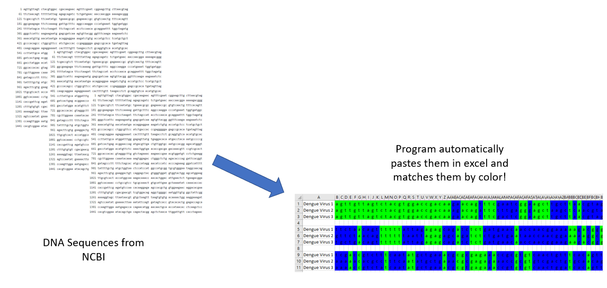

This program takes in dna sequences from a text file and then automatically pastes them
neatly in excel. It also color coats any matches that overlap between sequences.
I wrote this program to help out one of my lab mates that used to do this manually... before I gave them
my program.

See screen shots!
